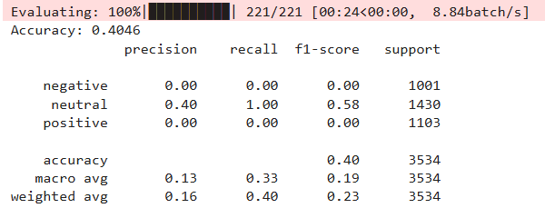
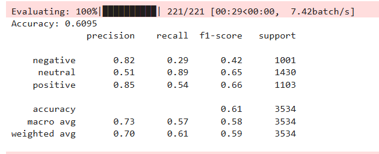

# Sentiment Analysis App 

A full-stack sentiment analysis application powered by a fine-tuned BERT model. It classifies text as **Positive**, **Negative**, or **Neutral** using a FastAPI backend and a Gradio frontend, fully containerized with Docker.

## Architecture

```
┌─────────────────┐       HTTP POST        ┌─────────────────────┐
│   Gradio UI      │ ───────────────────►  │   FastAPI Backend    │
│   (port 7860)    │ ◄─────────────────── │   (port 8000)        │
└─────────────────┘     JSON response      │                     │
                                            │  Fine-tuned BERT    │
                                            │  Sentiment Model    │
                                            └─────────────────────┘
```

## Tech Stack

| Component  | Technology                          |
|------------|-------------------------------------|
| Model      | `google-bert/bert-base-uncased` (fine-tuned) |
| Backend    | FastAPI + Uvicorn                   |
| Frontend   | Gradio                              |
| ML Stack   | PyTorch, HuggingFace Transformers   |
| Deployment | Docker, Docker Compose              |

## Fine-Tuning Results

The base BERT model was fine-tuned on a [Twitter sentiment dataset from Kaggle](https://www.kaggle.com/datasets/abhi8923shriv/sentiment-analysis-dataset). See the notebook in `notebooks/` for the full training pipeline.

| Metric     | Before Fine-Tuning | After Fine-Tuning |
|------------|--------------------|--------------------|
| See images | `metrics/Before_finetune.png` | `metrics/After_finetune.png` |

**Before fine-tuning:**



**After fine-tuning:**



The fine-tuned model is hosted on HuggingFace Hub: [`Wolverine001/bert_finetuned_senti`](https://huggingface.co/Wolverine001/bert_finetuned_senti)

---

## Getting Started

### Prerequisites

- Python 3.9+
- Docker & Docker Compose (for containerized setup)

### Option 1: Docker (Recommended)

**Step 1 — Download the model:**

```bash
copy .env.example .env    #windows
# cp .env.example .env    # linux
# Edit .env and add your HuggingFace token
```

```bash
cd backend
pip install transformers torch python-dotenv huggingface_hub
python model.py
cd ..
```

This creates a `backend/model/` directory with the saved model weights.

**Step 2 — Build and run:**

```bash
docker compose up --build
```

- Frontend: http://localhost:7860
- Backend API: http://localhost:8000
- API Docs: http://localhost:8000/docs

### Option 2: Run Locally

**Step 1 — Download the model** (same as above):

```bash
copy .env.example .env
# Edit .env and add your HuggingFace token

cd backend
pip install -r requirements.txt
python model.py
```

**Step 2 — Start the backend:**

```bash
# Still in backend/
uvicorn app:app --host 0.0.0.0 --port 8000
```

**Step 3 — Start the frontend** (in a new terminal):

```bash
cd frontend
pip install -r requirements.txt

# Point to local backend
export API_URL=http://127.0.0.1:8000/predict
python gradio_ui.py
```

### API Usage

```bash
curl -X POST http://localhost:8000/predict \
  -H "Content-Type: application/json" \
  -d '{"text": "I love this product!"}'
```

Response:

```json
{
  "sentiment": "positive",
  "confidence": {
    "negative": 0.02,
    "neutral": 0.05,
    "positive": 0.93
  }
}
```

---

## Project Structure

```
sentiment_bert_finetune-main/
├── backend/
│   ├── app.py              # FastAPI application & routes
│   ├── main.py             # Model loading & inference logic
│   ├── model.py            # Script to download model from HF Hub
│   ├── requirements.txt
│   ├── Dockerfile
│   └── .dockerignore
├── frontend/
│   ├── gradio_ui.py        # Gradio web interface
│   ├── requirements.txt
│   ├── Dockerfile
│   └── .dockerignore
├── notebooks/
│   └── google-bert-twitter-sentiment.ipynb
├── metrics/
│   ├── Before_finetune.png
│   └── After_finetune.png
├── tests/
│   └── test_predict.py
├── .env.example
├── .gitignore
├── .dockerignore
├── docker-compose.yml
├── Makefile
├── LICENSE
└── README.md
```

## Running Tests

```bash
pip install pytest
pytest tests/ -v
```

---

## Contributing

1. Fork the repository
2. Create a feature branch (`git checkout -b feature/my-feature`)
3. Commit your changes (`git commit -m 'Add my feature'`)
4. Push to the branch (`git push origin feature/my-feature`)
5. Open a Pull Request

## License

This project is licensed under the MIT License — see [LICENSE](LICENSE) for details.
